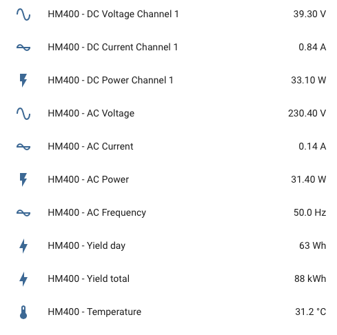

# Hoymiles Inverter Sensor for ESPHome on ESP32


### Warning: This whole project is in development and not yet ready for a stable ruinning in production. ###

## 1. Usage

### 1.1 External components (github)

***Not tested yet***

Use latest ESPHome (at least v1.18.0) with external components and add this to your .yaml definition:

```yaml
esphome:
  libraries:                #built-in libraries
    - "SPI"
    - "nrf24/RF24@^1.4.2"

external_components:
  - source: github://grindylow/ahoy/tools/esphome
```

### 1.2 Use local components

Clone the repository into you local esphome folder. Adjust the folder in the `yaml` configuration.

```yaml
external_components:
  - source: my_components/ahoy/tools/esphome/components
```

The following commands can be used to compile, upload and monitor the esp32
```bash
esphome compile hoymiles.yaml
esphome upload hoymiles.yaml --device /dev/cu.usbserial-0001
esphome logs hoymiles.yaml --device /dev/cu.usbserial-0001
```

## 2 Component

### 2.1 `hoymiles`
This section defines which GPIO Pins are connected to the NRF24L01+ module and to which intervers should be connected.

Up to 3 inverters can be configured. Every inverter needs its own id!

```yaml
hoymiles:
    inverters:
      - id: hm400
        serialnumber: "0x1234567890"
    cs_pin: 5
    ce_pin: 4
    irq_pin: 17
```

### 2.2 Sensor

Every inverter needs it own sensor. The `platform: hoymiles` **sensor can be used multiple times**. 

`inverter_id` **make sure this ID is defined and unique** in the `hoymiles` component

`update_interval` **is required**. Without this interval, **no data will be consumed**

`channel_n` every inverter has different channels / solar panel inputs. Define the correct amout for your inverter. Up to **6 channels** can be defined.

The configuration below highlights all possible configuration. If one (sub)sensor (as example: temperature, current, voltage) is not defined with a `name`, this data will **not be consumed**.

#### `general`
Statisics about the device - including total production dayly and total

#### `grid`
Statistics about the Grid AC Part

#### `channel_n`
Statistics about the panels DC Part

```yaml
sensor:
      
  - platform: hoymiles
    inverter_id: hm400
    update_interval: 30s

    general:
      temperature:
        name: "HM400 - Temperature"

      yield_day:
        name: "HM400 - Yield day"

      yield_total:
        name: "HM400 - Yield total"

      efficiency:
        name: "HM400 - Efficiency"

      power:
        name: "HM400 - DC Power Total"        

    grid:
      current:
        name: "HM400 - AC Current"
      voltage:
        name: "HM400 - AC Voltage"
      power:
        name: "HM400 - AC Power"
      frequency:
        name: "HM400 - AC Frequency"

    channel_1:
      current:
        name: "HM400 - DC Current Channel 1"
      voltage:
        name: "HM400 - DC Voltage Channel 1"
      power:
        name: "HM400 - DC Power Channel 1"
      irradiation:
        name: "HM400 - Irradiation Channel 1"

      yield_day:
        name: "HM400 - Yield day Channel 1"

      yield_total:
        name: "HM400 - Yield total Channel 1"         

    channel_2:
    channel_3:
    ...

```

## 3. Integrations

### 3.1 HomeAssistant



## 4. Troubleshooting

### 4.1 `src/esphome/components/hoymiles/hmRadio.h:9:18: fatal error: RF24.h: No such file or directory`

External libaries not defined. Add following to the `yaml` configuration

```yaml
esphome:
  libraries:                #built-in libraries
    - "SPI"
    - "nrf24/RF24@^1.4.2"
```

### 4.2 `src/esphome/components/hoymiles/hoymiles_sensor.h:4:46: fatal error: esphome/components/sensor/sensor.h: No such file or directory`

No sensor defined. Define a sensor like described in 2.2 Sensor or add an example sensor to the `yaml` configuration

```yaml
sensor:
  - platform: uptime
    name: HM400 - Uptime Sensor
```

## 5. Super experimental features
Using these features is at your own risk and may damage the device.

### 5.1 ON / Off

```yaml
switch:
  - platform: hoymiles
    inverter_id: hm400

    name: "HM400 - Switch On/Off"
```

`inverter_id` must be the same one that is defined in the `hoymiles`component.

### 5.2 Limiting with absolute number

```yml
number:
  - platform: hoymiles
    inverter_id: hm400
    name: "HM400 - Limit"
    max_power: 400
```

### 5.3 Restart

```yml
button:
  - platform: hoymiles
    inverter_id: hm400
    name: "HM400 - Restart"
    type: RESTART
```


## 6. Issues

### 6.1 Open Issues
#### Console logging is not showing the recieved data
Currently the debug information is send directly to Serial and cannot be displayed in HomeAssistant when connected via browser

### 6.2 Closes Issues
### Esp8266 code is not working with ESP32
Some minor differences in the original ahoy code. The F("String") macro returns a FlashStringHelper type that cannot be concatinated with a normal String. Therefore all String concatinations needs to be sparated.

### Crc16 and crc8 already exists 
The Esphome enviroment declares crc8 and crc16 globally. It's required to wrap the ahoy CRC functionally into an own namespace

## 7. Support

## Thanks
[ZsZs73](https://github.com/ZsZs73/ahoy)
[grindylow](https://github.com/grindylow)

## Testted Platforms:
- [x] ESP32

## Tested Inverter
- [ ] Hoymiles HM350
- [x] Hoymiles HM400 (1 channel)
- [ ] Hoymiles HM600 (2 channel)
- [ ] Hoymiles HM1200

## Testted Environments:
- [x] Console - MacOs
- [x] HomeAssistant - EspHome Plugin